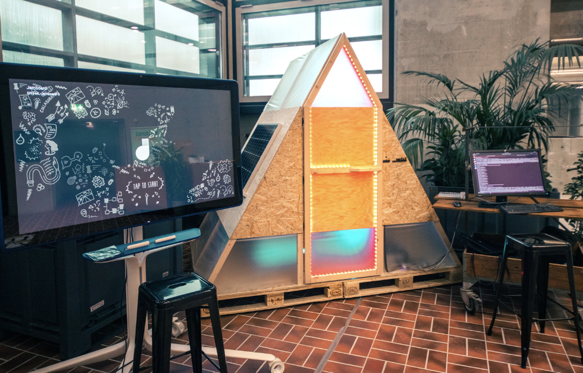
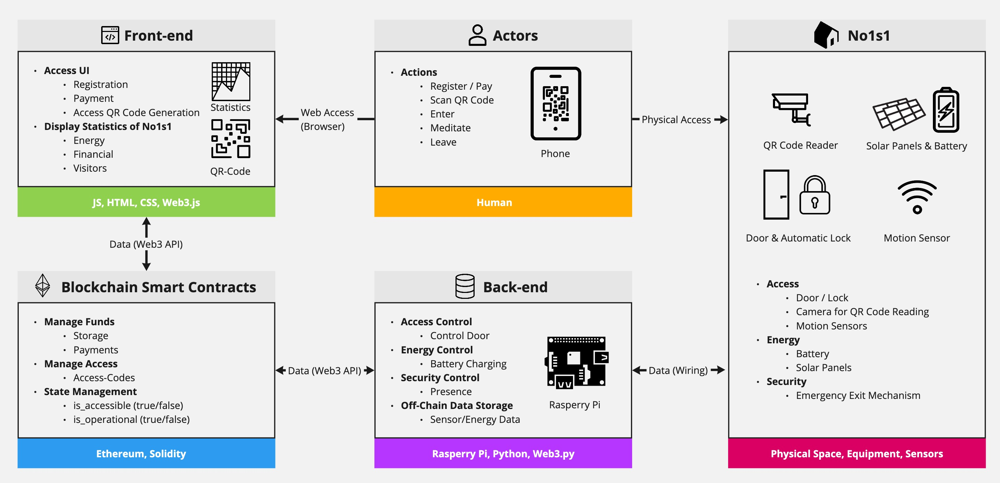

# no1s1

This repository contains resources and code for the no1s1 prototype and replaces the [old repo](https://github.com/Unawhatitis/no1s1_TI). It is maintained by [Unawhatitis](https://github.com/Unawhatitis) and [hujens](https://github.com/hujens).

This prototype implementation started as a research project between [Dezentrum](https://www.dezentrum.ch/en/case-studies/no1s1) and [ETH Zurich Chair of IC](https://ic.ibi.ethz.ch/).The associated research is published [here (Journal Paper)](https://doi.org/10.1016/j.autcon.2025.106309) and [here (Conference Paper)](http://www.doi.org/10.35490/EC3.2021.185). If you are interested in a collaboration, please contact us.

## The no1s1 Prototype

### Origin

The idea behind no1s1 to use blockchain to allow things to own and organize themselves has been mentioned in several places. Especially noteworthy is the article written by Trent McConaghy on [Nature 2.0](https://blog.oceanprotocol.com/nature-2-0-27bdf8238071?gi=d17a83f090a1).

The no1s1 prototype was also not the first prototype of a self-owning thing. Primavera di Filippi built the [Plantoid](https://www.plantoid.org/), and an earlier prototype by Dezentrum was [SattelETH](https://www.dezentrum.ch/en/case-studies/ein-autonomer-satellit-auf-weltreise). But no1s1 was the first prototype that applied this idea to the built environment, with the name and idea coming from the Dezentrum think tank: [no1s1 Whitepaper](https://github.com/no1s1/whitepaper).

The subsequent collaboration between [Dezentrum](https://www.dezentrum.ch/en/) and [ETH Zurich Chair of IC](https://ic.ibi.ethz.ch/) led to the development of this prototype.

### Implementation

<figure></figure>

The prototype represents a self-owned, single-user meditation space. This functionality was chosen for its simplicity. The smart contracts that hold no1s1's funds and control the logic around revenue and access mechanisms live on the [Ethereum](https://ethereum.org/en/) blockchain. no1s1 earns money by selling access. The prototype has solar panels to generate electricity, but can also be connected to the grid. For more detailed information, please refer to the resources listed below.

<!-- *Please note:* The project is under active development and the functionality is constantly being extended. Please read the documentation inside the code folders for more information. -->

### Resources

For the curious reader we list here resources about this no1s1 prototype.

| Recommended resources:  |
| ----------- |
| [A small house raises big questions](https://ethz.ch/en/news-and-events/eth-news/news/2021/10/a-small-house-raises-big-questions.html), ETH News Article, October 2021 |
| [What happens when buildings own and manage themselves?](https://www.ey.com/en_ch/strategy/what-happens-when-buildings-own-and-manage-themselves), EY Parthenon, October 2021 |
| JJ Hunhevicz, H Wang, L Hess, DM Hall; *"no1s1 - A Blockchain-Based DAO Prototype for Autonomous Space"*; [EC<sup>3</sup> Proceedings](https://ec-3.org/publications/conferences/2021/paper/?id=185), [Conference Video](https://youtu.be/iyz45BHiRrc) ; 2021|
| H Wang, J Hunhevicz, DM Hall; *"What if properties are owned by no one or everyone? Foundations of blockchain enabled engineered ownership"*; [EC<sup>3</sup> Proceedings](http://www.doi.org/10.35490/EC3.2022.213), [Conference Video](https://www.youtube.com/watch?v=JFbBB8GSObI) ; 2022|
| H Wang, J Hunhevicz, DM Hall; *"From automation to agency: Prototype for self-owning intelligent buildings enabled by blockchain"*; [Automation in Construction](https://doi.org/10.1016/j.autcon.2025.106309); 2025|

| Further resources:  |
| ----------- |
| [From no1s1, a Self-Owning House, to Decentralized Autonomous Spaces](https://www.youtube.com/watch?v=LKWg7UzarLI), Web3 Gallery - A Glimpse into the Future, July 2022 |
| no1s1 attended [World Economic Forum](https://ethz.ch/en/the-eth-zurich/global/eth-global-news-events/2021/12/rethinking-living-exhibition.html) 2022 in Davos, [Exhibition Video](https://vimeo.com/6.578055e+08), May 2022 |
| no1s1 was featured in [SRF Panorama](https://www.srf.ch/play/radio/redirect/detail/8cacb877-d003-495f-8396-78a8d82f1c08), March 2022 |
| [Schweiz Aktuell](https://www.srf.ch/play/tv/schweiz-aktuell/video/ideen-labor-fuer-studierende?urn=urn:srf:video:652dfc9b-217d-402f-9d1e-9d4ee0db6557) featured an interview on no1s1 live at a Student Project House, November 2021 |
| Livestream with [Engineering ArchiTECHure](https://www.youtube.com/watch?v=Yh_8DTkG1dQ) on our research and prototype implementation, October 2021 |
| [Vom Warenkorb ins Blockchain-Haus: So haben wir no1s1 ausgestattet](https://www.digitec.ch/de/page/vom-warenkorb-ins-blockchain-haus-so-haben-wir-no1s1-ausgestattet-21619), Digitec Galaxus, October 2021 |
| [Das sich selbst besitzende Haus ist ein Traum für Mieter](https://www.blick.ch/wirtschaft/eth-zeigt-prototyp-no1s1-das-sich-selbst-besitzende-haus-ist-ein-traum-fuer-mieter-id16941802.html), Blick, October 2021 |
| [ETH präsentiert Haus, das sich selbst besitzt und verwaltet](https://www.swissinfo.ch/ger/eth-praesentiert-haus--das-sich-selbst-besitzt-und-verwaltet/47064260), swissinfo.ch, October 2021 |
| [Unter dem Namen «no1s1» – ETH präsentiert Haus, das sich selbst besitzt und verwaltet](https://www.watson.ch/wissen/technik/352728172-eth-praesentiert-haus-das-sich-selbst-besitzt-und-verwaltet), Watson, October 2021 |

### Technical System and Human/Machine Interaction

The figure below illustrates the main technical parts of the no1s1 prototype and their interactions (Source: Slightly adapted from [Hunhevicz et al., 2021](https://ec-3.org/publications/conferences/2021/paper/?id=185)).

<figure></figure>

## Code

This repo contains code for the no1s1 prototype. It is organized into folders that cover the above introduced technical aspects of the prototype. Please read the README files inside the folders for further documentation.

```none
../no1s1
├── backend             Python scripts for the RaspberryPi of no1s1.
│   └── README          Documentation
│   └── rpi_V1          Back end code for the V1 contract version.
│   └── rpi_WEF         Back end code for the WEF contract version.
├── contracts           Code related to the smart contracts of no1s1.
│   ├── README          Documentation
│   ├── contracts       Smart contracts for V1 and WEF.
│   └── test            Test cases
├── frontend            Code for the dApp of no1s1.
│   └── README          Documentation
│   └── no1s1_V1        Front end code for the V1 contract version.
├── media               Pictures and videos on no1s1
├── README              Background and resources
└── LICENSE             MIT License
```
