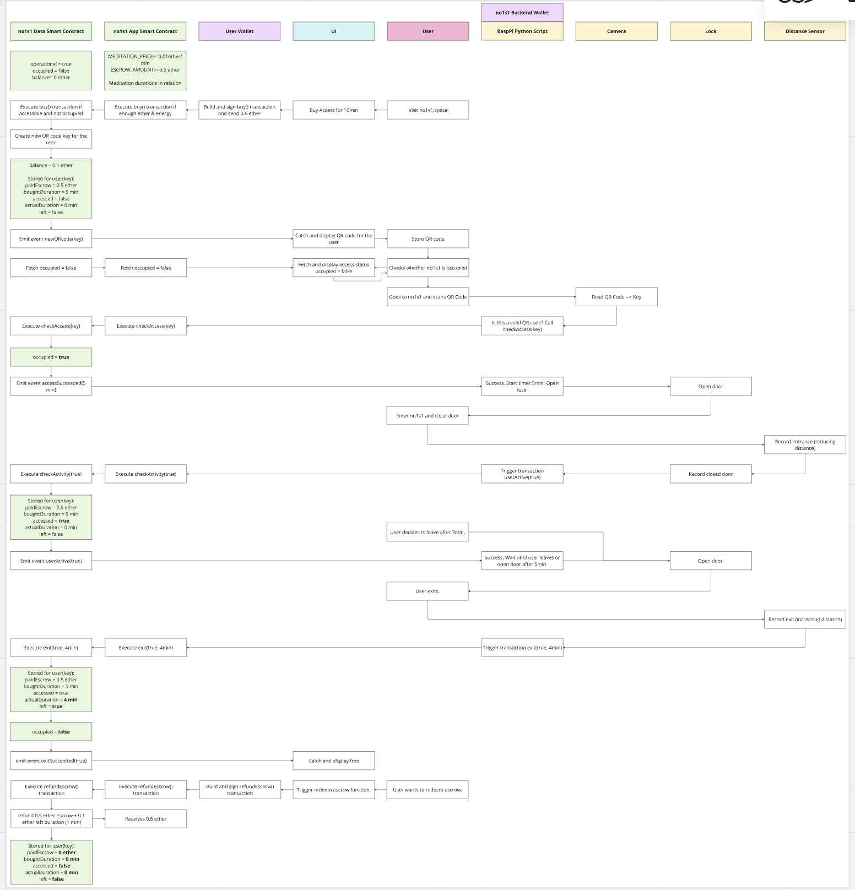
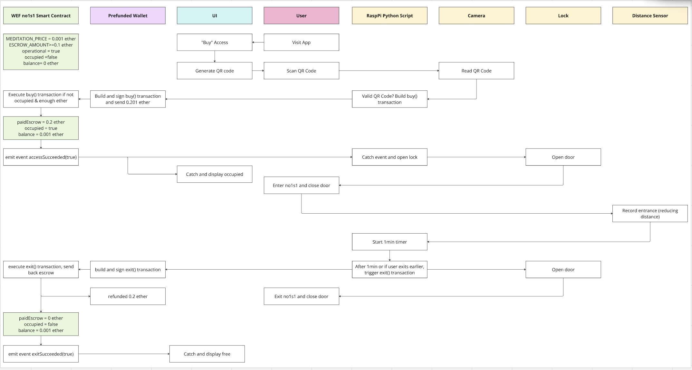

# no1s1 Smart Contracts

This repository contains the smart contracts for the no1s1 prototype. The various contracts are described below.

<!-- Describe where live contracts are deployed. -->

## no1s1 Contracts V1

The contracts [no1s1App_V1.sol](./contracts/no1s1App_V1.sol) and [no1s1Data_V1.sol](./contracts/no1s1Data_V1.sol) together provided the functionality of the initial prototype. They use the OpenZeppelin [SafeMath.sol](https://github.com/OpenZeppelin/openzeppelin-contracts/blob/master/contracts/utils/math/SafeMath.sol) contract for overflow protection.

The two contracts work together with the [rpi_V1](../backend/rpi_WEF) Raspberry Pi scripts and the [no1s1_V1](../frontend/no1s1_V1) frontend.

The following figure details the interaction between the different smart contracts, smart contract functions, and the other technical componenents:

<figure></figure>

<!-- Describe functionality -->

## no1s1 Contract WEF

For the exhibition at the World Economic Forum 2022, we used a reduced version of the V1 contracts for a simplified demonstration of the prototype: [no1s1WEF.sol](.//contracts/no1s1WEF.sol). Unlike the V1 contracts, it does not go through all the access and exit checks, but only triggers a 1min timer once the house receives the payment (see [rpi_WEF](../backend/rpi_WEF)).

The following figure details the interaction between the smart contract functions and the other technical componenents:

<figure></figure>

<!-- Describe functionality -->

<!-- ## no1s1 Contracts V2

Latest version of no1s1 smart contracts. Work in progress.

<!-- Describe newest contracts -->

## Getting started -->

### Option 1: Develop and Test with Truffle/Ganache and Local Network

Install [Truffle Suite](https://truffleframework.com/), [node.js](https://nodejs.org/en/) and [Metamask](https://metamask.io/).

Clone this repository and change to the project directory. Install all prerequisites, e.g. the [Openzeppelin Contracts](https://www.openzeppelin.com/contracts) with:

```sh
npm install
```

Launch Ganache-Cli with the following seed to get the correct test accounts:

```sh
ganache-cli -m "spirit supply whale amount human item harsh scare congress discover talent hamster"
```

Alternatively, you can use the Ganache-GUI by changing the develpment port (7545 instead of 8545) in [truffle-config.js](./truffle-config.js).

Make sure the [2_no1s1_migration.js](./migrations/2_no1s1_migration.js) file contains the correct smart contracts you want to deploy. Then compile and migrate the smart contracts:

```sh
truffle compile
truffle migrate --reset --network development
```

To run the unit tests of the smart contracts:

```sh
truffle test
```

Point Metamask to your localhost network and import the needed private keys. You are ready to go!

### Option 2: Develop and Test with Remix and Local Network

Instead of using Truffle and Ganache, [Remix IDE](https://remix.ethereum.org/) is a nice way for fast contract testing and development. It automatically provides a GUI to interact with the smart contract functions. Just import the .sol files and compile and deploy to your preffered network.
